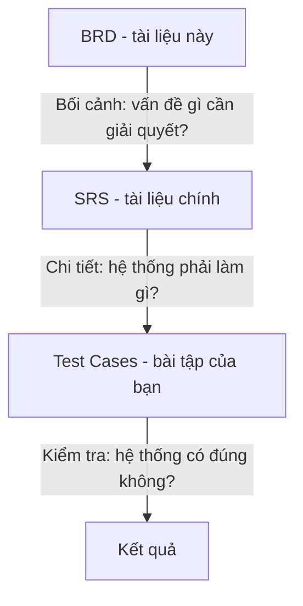
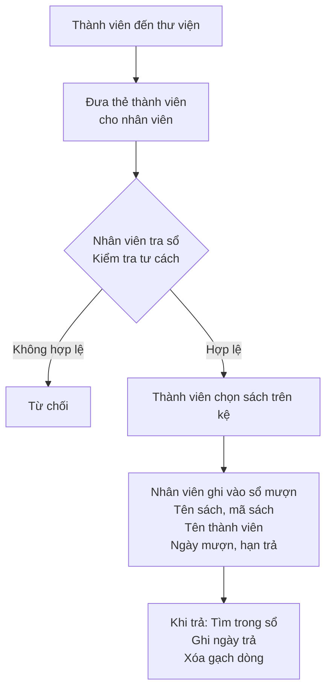
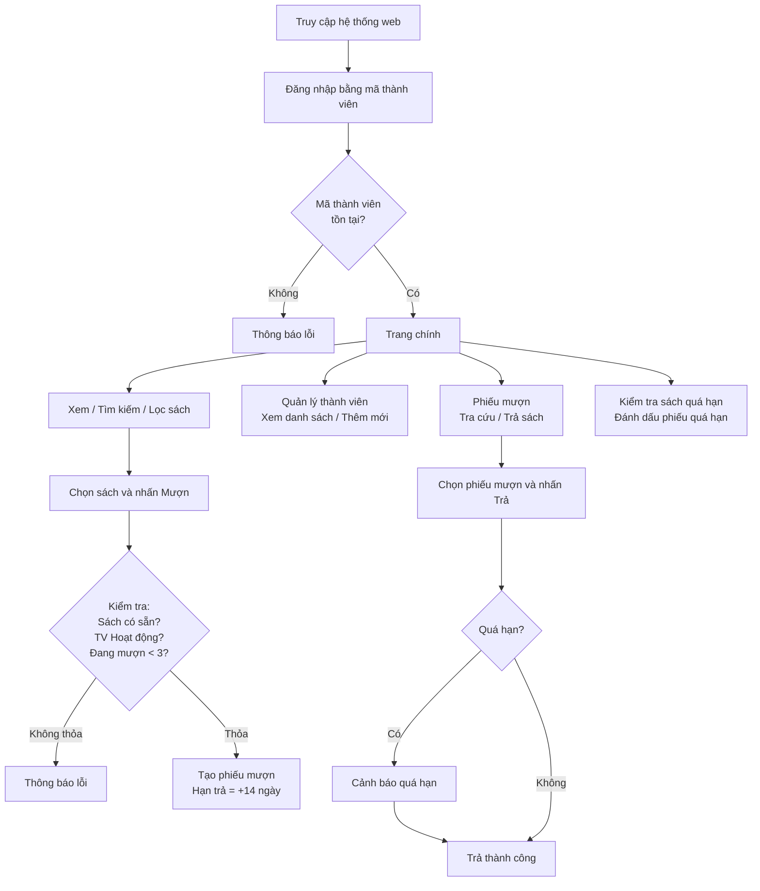

# BRD — Tài liệu Yêu cầu Nghiệp vụ
## (Business Requirements Document)

> **� Hệ thống hư cấu / Fictional System**: Thư viện ABC là hệ thống **hư cấu** được thiết kế cho mục đích học tập. Tên nhân vật, tổ chức và dữ liệu đều là giả lập. / *ABC Library is a **fictional** system designed for educational purposes. All names, organizations, and data are simulated.*

> **�📌 Lưu ý cho sinh viên**: Đây là tài liệu **tham khảo** (reference). Bạn **không** viết test case dựa trên BRD.
>
> BRD giúp bạn hiểu **tại sao** hệ thống được xây dựng và yêu cầu **đến từ ai**. Tài liệu chính để kiểm thử là **SRS** (SRS-library-system.md).

> **⚠️ Lưu ý quan trọng**: BRD là phiên bản yêu cầu **ban đầu** từ khách hàng. Trong quá trình phân tích, BA đã điều chỉnh một số chi tiết khi viết SRS (ví dụ: BRD ghi "đăng nhập bằng mã thành viên" → SRS đổi thành "đăng nhập bằng email + mật khẩu"). Đây là điều **bình thường** trong dự án thực tế — SRS luôn là phiên bản **chính xác hơn** để kiểm thử.

| Thông tin tài liệu | |
|---|---|
| **Dự án** | Hệ thống Quản lý Mượn sách — Thư viện ABC |
| **Phiên bản** | 1.0 |
| **Ngày tạo** | 01/06/2024 |
| **Người yêu cầu** | Ông Trần Văn Thư — Giám đốc Thư viện ABC (Customer / Khách hàng) |
| **Người tiếp nhận** | Bà Nguyễn Thị Quản — Trưởng dự án / Project Manager (PM), Công ty phần mềm XYZ |

---

## 1. Bối cảnh

Thư viện ABC là một thư viện nhỏ phục vụ cộng đồng sinh viên, hiện đang quản lý việc mượn/trả sách bằng **sổ ghi chép thủ công**. Quy trình hiện tại gặp nhiều vấn đề:

- Nhân viên quản lý **mất nhiều thời gian** tìm kiếm sách trong sổ.
- Thường xuyên **nhầm lẫn** trạng thái sách (đã trả hay chưa trả).
- Không có cơ chế **cảnh báo quá hạn** — nhiều sách bị mượn quá lâu mà không biết.
- Thành viên thư viện **không tra cứu** được lịch sử mượn của mình.
- Khó kiểm soát số lượng sách mỗi người đang mượn.

Giám đốc thư viện mong muốn có một **ứng dụng web đơn giản** để tin học hóa quy trình này.

---

## 2. Mục tiêu nghiệp vụ

| Mã | Mục tiêu | Độ ưu tiên |
|----|---------|-----------|
| BO-01 | Số hóa quy trình mượn/trả sách, thay thế sổ ghi chép | Cao |
| BO-02 | Tự động cảnh báo khi sách quá hạn trả | Cao |
| BO-03 | Giới hạn số sách mỗi thành viên được mượn cùng lúc | Cao |
| BO-04 | Cho phép tìm kiếm sách nhanh chóng theo tên, tác giả hoặc thể loại | Trung bình |
| BO-05 | Quản lý danh sách thành viên và trạng thái hoạt động | Trung bình |
| BO-06 | Mỗi thành viên tự tra cứu được lịch sử mượn/trả của mình | Trung bình |
| BO-07 | Giao diện đơn giản, dễ sử dụng cho nhân viên thư viện | Cao |

---

## 3. Phạm vi dự án

### 3.1. Trong phạm vi (In-scope)

- Đăng nhập bằng mã thành viên (không cần mật khẩu — hệ thống nội bộ nhỏ).
- Quản lý danh mục sách (xem, tìm kiếm, lọc).
- Quy trình mượn sách với kiểm tra ràng buộc.
- Quy trình trả sách với cảnh báo quá hạn.
- Quản lý thành viên (xem danh sách, đăng ký mới).
- Kiểm tra và đánh dấu sách quá hạn.
- Tra cứu phiếu mượn cá nhân.
- Hỗ trợ song ngữ Việt–Anh.

### 3.2 Ngoài phạm vi (Out-of-scope)

- Thanh toán phí phạt (chưa cần trong giai đoạn đầu).
- Đặt trước sách (reservation).
- Thông báo qua email/SMS.
- Quản lý kho sách vật lý (kệ, vị trí).
- Ứng dụng di động.
- Báo cáo thống kê nâng cao.

---

## 4. Quy trình nghiệp vụ hiện tại (As-Is)

**Vấn đề chính:**
- Tra sổ chậm, dễ nhầm.
- Không có cơ chế nhắc quá hạn.
- Không biết ai đang mượn bao nhiêu sách.
- Thành viên hết hạn hoặc bị tạm ngưng vẫn có thể mượn nếu nhân viên quên kiểm tra.

---

## 5. Quy trình nghiệp vụ mong muốn (To-Be)

---

## 6. Quy tắc nghiệp vụ

| Mã | Quy tắc | Chi tiết |
|----|---------|---------|
| BR-01 | Giới hạn mượn sách | Mỗi thành viên được mượn tối đa **3 sách** cùng lúc |
| BR-02 | Thời hạn mượn | **14 ngày** kể từ ngày mượn |
| BR-03 | Điều kiện mượn — trạng thái thành viên | Chỉ thành viên **"Hoạt động"** mới được mượn. "Tạm ngưng" và "Hết hạn" bị từ chối |
| BR-04 | Điều kiện mượn — trạng thái sách | Chỉ sách **"Có sẵn"** mới được mượn. "Đang mượn" và "Thất lạc" không được phép |
| BR-05 | Quá hạn | Sách đến ngày hạn trả (bao gồm chính ngày đó) được coi là **quá hạn** |
| BR-06 | Cảnh báo trả quá hạn | Khi trả sách quá hạn, hệ thống phải hiển thị **cảnh báo rõ ràng** |
| BR-07 | Bảo mật phiếu mượn | Mỗi thành viên **chỉ xem được** phiếu mượn của chính mình |
| BR-08 | Xác nhận email | Email thành viên phải có dạng `user@domain.ext` (có dấu chấm trong domain) |
| BR-09 | Xác nhận số điện thoại | Bắt đầu bằng `0`, đúng **10 chữ số** |
| BR-10 | Tìm kiếm không phân biệt hoa/thường | Tìm kiếm sách theo tên, tác giả, thể loại phải **case-insensitive** |

---

## 7. Các bên liên quan (Stakeholders)

| Vai trò | Người đại diện | Mối quan tâm chính |
|---------|---------------|-------------------|
| Giám đốc thư viện (Customer) | Ông Trần Văn Thư | Hệ thống chạy ổn định, thay thế sổ ghi chép |
| Nhân viên thư viện (End User) | 2 nhân viên | Giao diện dễ dùng, thao tác nhanh |
| Thành viên thư viện (End User) | ~50 thành viên | Tra cứu sách dễ, xem lịch sử mượn |

---

## 8. Ràng buộc và giả định

### Ràng buộc:
- Ngân sách hạn chế → ưu tiên ứng dụng web, không làm mobile.
- Không có server riêng → chấp nhận dữ liệu in-memory (reset khi tải lại trang) trong giai đoạn đầu.
- Thời gian phát triển: **4 tuần**.

### Giả định:
- Thư viện có khoảng 50–100 đầu sách, không cần phân trang phức tạp.
- Số thành viên hoạt động: 30–50 người.
- Hệ thống được truy cập trên máy tính để bàn, trình duyệt Chrome.
- Không cần xác thực phức tạp (mã thành viên là đủ cho nội bộ).

---

## 9. Tiêu chí nghiệm thu (Acceptance Criteria)

| Mã | Tiêu chí | Phương pháp kiểm tra |
|----|---------|---------------------|
| AC-01 | Đăng nhập thành công bằng mã thành viên hợp lệ | Nhập mã → Vào được hệ thống |
| AC-02 | Từ chối mã thành viên không tồn tại | Nhập mã sai → Thông báo lỗi |
| AC-03 | Tìm kiếm sách theo tên/tác giả | Gõ từ khóa → Kết quả đúng |
| AC-04 | Mượn sách thành công với đầy đủ điều kiện | Mượn → Phiếu mượn được tạo |
| AC-05 | Từ chối mượn khi vượt giới hạn 3 sách | Mượn sách thứ 4 → Bị từ chối |
| AC-06 | Trả sách thành công | Trả → Sách chuyển về "Có sẵn" |
| AC-07 | Cảnh báo khi trả sách quá hạn | Trả quá hạn → Có thông báo cảnh báo |
| AC-08 | Thêm thành viên mới hợp lệ | Nhập thông tin đúng → Thành viên xuất hiện trong danh sách |
| AC-09 | Mỗi thành viên chỉ xem phiếu mượn của mình | Đăng nhập A → Không xem được phiếu của B |
| AC-10 | Giao diện hỗ trợ Tiếng Việt và Tiếng Anh | Chuyển đổi ngôn ngữ → Giao diện thay đổi |

---

## 10. Lịch trình mong muốn

| Giai đoạn | Thời gian | Sản phẩm |
|-----------|----------|---------|
| Phân tích yêu cầu | Tuần 1 | SRS hoàn chỉnh |
| Thiết kế & Phát triển | Tuần 2–3 | Ứng dụng web hoàn chỉnh |
| Kiểm thử | Tuần 4 | Báo cáo kiểm thử, sửa lỗi |
| Bàn giao | Cuối tuần 4 | Hệ thống sẵn sàng sử dụng |

---

*Ký duyệt:*

| | Họ tên | Chức vụ | Ngày |
|---|--------|--------|------|
| **Người yêu cầu** | Trần Văn Thư | Giám đốc Thư viện ABC (Customer) | 01/06/2024 |
| **Người tiếp nhận** | Nguyễn Thị Quản | Trưởng dự án / PM, Cty XYZ | 03/06/2024 |
