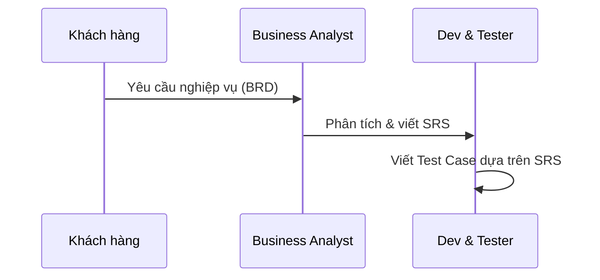

# SRS — Đặc tả yêu cầu phần mềm / Software Requirements Specification

> **📚 Hệ thống hư cấu / Fictional System**: Thư viện ABC là hệ thống **hư cấu** được thiết kế cho mục đích học tập. Tên nhân vật, tổ chức và dữ liệu đều là giả lập. / *ABC Library is a **fictional** system designed for educational purposes. All names, organizations, and data are simulated.*

**Hệ thống**: Quản lý mượn sách Thư viện ABC  
**URL**: https://stqa.rbc.vn  
**Phiên bản**: 1.0  
**Ngôn ngữ giao diện**: Tiếng Việt (mặc định), English  
**Công nghệ**: Flutter Web (CanvasKit renderer)

| Thông tin tài liệu | |
|---|---|
| **Tác giả** | Lê Phân Tích — Business Analyst (BA) |
| **Ngày tạo** | 05/06/2024 |
| **Dựa trên** | [BRD v1.0](BRD-yeu-cau-nghiep-vu.md) — Yêu cầu nghiệp vụ từ Giám đốc Thư viện ABC (01/06/2024) |
| **Trạng thái** | Đã duyệt bởi các bên liên quan |

---

## 📖 Hướng dẫn đọc tài liệu / How to Read This Document

> Phần này dành cho sinh viên, giúp bạn hiểu **bối cảnh** của tài liệu SRS trước khi đi vào nội dung kỹ thuật ở **mục 1** trở đi.

### Yêu cầu phần mềm đến từ đâu?

Trong một dự án phần mềm thực tế, yêu cầu **không tự nhiên xuất hiện**. Chúng đi qua một chuỗi tài liệu:

| Bước | Tài liệu | Ai tạo | Mục đích |
|------|----------|--------|----------|
| 1 | **BRD** — Yêu cầu nghiệp vụ 📄 [Xem BRD](BRD-yeu-cau-nghiep-vu.md) | Khách hàng (Giám đốc Thư viện ABC) + PM | Mô tả **vấn đề kinh doanh** cần giải quyết |
| 2 | **SRS** — Đặc tả yêu cầu phần mềm *(tài liệu này)* | Business Analyst (BA) | Chuyển yêu cầu nghiệp vụ thành **yêu cầu kỹ thuật** chi tiết |
| 3 | **Test Cases** — Kịch bản kiểm thử | Tester *(vai trò của bạn)* | Kiểm tra phần mềm **có đúng yêu cầu không** |

### Các bên liên quan (Stakeholders)

| Vai trò | Đại diện | Quan tâm điều gì |
|---------|----------|-------------------|
| **Khách hàng** (Customer) | Ông Trần Văn Thư — Giám đốc Thư viện ABC | Hệ thống giải quyết đúng vấn đề nghiệp vụ |
| **Quản lý dự án** (PM) | Bà Nguyễn Thị Quản — Trưởng dự án | Phạm vi, tiến độ, chi phí |
| **Phân tích nghiệp vụ** (BA) | Lê Phân Tích | Yêu cầu rõ ràng, đầy đủ, không mâu thuẫn |
| **Phát triển** (Dev) | Đội phát triển, Công ty XYZ | Yêu cầu đủ chi tiết để triển khai code |
| **Kiểm thử** (Tester) | **Bạn** | Yêu cầu đủ chi tiết để viết test case và xác định kết quả mong đợi |

### Tester dựa vào đâu để kiểm thử?

Tester **không tự nghĩ ra** kết quả đúng/sai. Mọi phán đoán đều dựa trên tài liệu SRS:

| Câu hỏi | Tìm ở đâu trong SRS |
|---------|---------------------|
| Input là gì? | Cột **Input** / **Điều kiện** trong mỗi REQ |
| Kết quả mong đợi (Expected Result)? | Cột **Quy tắc** / **Kết quả** / **Thông báo lỗi** |
| Dữ liệu test nào? | **Mục 3 — Dữ liệu ban đầu** |
| Ràng buộc kỹ thuật? | **Mục 5 — Ràng buộc kỹ thuật** |

> **Nguyên tắc quan trọng**: Nếu SRS ghi rõ hệ thống phải hoạt động theo cách X, nhưng thực tế hệ thống hoạt động khác → đó là **bug**. SRS chính là **nguồn sự thật** (source of truth) để xác định đúng/sai.

### Sinh viên cần làm gì với tài liệu này?

1. **Đọc kỹ từng yêu cầu** (REQ-01 → REQ-08) — đây là "hợp đồng" giữa khách hàng và đội phát triển
2. **Xác định expected result** từ mỗi yêu cầu — tập trung vào cột Quy tắc, Thông báo lỗi, Kết quả
3. **Sử dụng dữ liệu ban đầu** (mục 3) làm test data cho các test case
4. **Viết test case** cho từng yêu cầu — mỗi REQ có thể sinh ra nhiều test case (positive + negative)
5. **So sánh actual vs expected** khi thực thi kiểm thử — nếu khác nhau → ghi nhận bug

---

## 1. Tổng quan hệ thống / System Overview

Hệ thống quản lý mượn sách cho một thư viện nhỏ. Hai vai trò người dùng:

| Vai trò | Quyền hạn |
|---------|----------|
| **Thủ thư** (Librarian) | Xem tất cả sách, mượn/trả sách cho thành viên, quản lý thành viên, kiểm tra quá hạn, xem tất cả phiếu mượn, khôi phục dữ liệu |
| **Thành viên** (Member) | Xem danh sách sách, tìm kiếm/lọc, mượn sách (cho bản thân), trả sách (của mình), xem phiếu mượn của mình |

### Đặc điểm kỹ thuật

- Dữ liệu lưu **trong bộ nhớ trình duyệt** (client-side) — mỗi tab trình duyệt là một phiên riêng biệt
- Mỗi lần **mở lại trang hoặc refresh** = dữ liệu trở về trạng thái ban đầu (seed data)
- Nút **"Khôi phục dữ liệu"** (chỉ Thủ thư) = reset dữ liệu về seed data mà không cần refresh
- Mỗi đầu sách có **1 bản duy nhất** (1 copy per title)

---

## 2. Danh sách yêu cầu / Requirements List

### REQ-01: Đăng nhập / Login

| Mục | Nội dung |
|-----|---------|
| **Mô tả** | Người dùng đăng nhập bằng email và mật khẩu |
| **Input** | Email, mật khẩu |
| **Quy tắc** | `email@domain.ext` + mật khẩu đúng → chuyển sang trang chủ. Sai → hiểu thị thông báo lỗi phù hợp. |
| **Thông báo lỗi** | "Không tìm thấy thành viên" (email sai), "Mật khẩu không đúng" (MK sai), "Vui lòng nhập email và mật khẩu" (bỏ trống) |
| **Sau đăng nhập** | Hiển thị tên người dùng + vai trò trên thanh ứng dụng (AppBar) |

### REQ-02: Xem danh sách sách / View Book List

| Mục | Nội dung |
|-----|---------|
| **Mô tả** | Hiển thị tất cả sách trong thư viện |
| **Thông tin mỗi sách** | Tên sách, tác giả, thể loại, năm xuất bản, trạng thái (Có sẵn / Đã mượn) |
| **Quyền truy cập** | Cả Thủ thư và Thành viên đều xem được |
| **Cập nhật real-time** | Khi sách được mượn/trả → trạng thái cập nhật ngay lập tức |

### REQ-03: Tìm kiếm và lọc sách / Search & Filter Books

| Mục | Nội dung |
|-----|---------|
| **Tìm kiếm** | Theo tên sách hoặc tác giả |
| **Lọc** | Theo thể loại |
| **Quy tắc** | Tìm kiếm **KHÔNG phân biệt chữ hoa/thường** (case-insensitive) |
| **Không có kết quả** | Hiển thị thông báo "Không tìm thấy sách" |

### REQ-04: Mượn sách / Borrow Book

| Mục | Nội dung |
|-----|---------|
| **Điều kiện** | Sách ở trạng thái "Có sẵn" (available) |
| **Giới hạn** | Tối đa **3 sách / thành viên** cùng lúc |
| **Thời hạn** | 14 ngày kể từ ngày mượn |
| **Từ chối nếu** | Sách đã được mượn, thành viên đạt giới hạn 3 sách, thành viên bị **tạm ngưng** hoặc **hết hạn** |
| **Thông báo lỗi** | Phải mô tả **đúng lý do** từ chối (tạm ngưng ≠ hết hạn) |

### REQ-05: Trả sách / Return Book

| Mục | Nội dung |
|-----|---------|
| **Điều kiện** | Chỉ trả sách mà thành viên **đang mượn** |
| **Kết quả** | Sách chuyển về trạng thái "Có sẵn" |
| **Quá hạn** | Nếu trả quá hạn → hệ thống phải hiển thị **cảnh báo quá hạn** |

### REQ-06: Xử lý sách quá hạn / Overdue Handling

| Mục | Nội dung |
|-----|---------|
| **Kích hoạt** | Thủ thư nhấn nút "Kiểm tra quá hạn" |
| **Quy tắc** | Phiếu mượn có `dueDate` ≤ ngày hiện tại → đánh dấu "Quá hạn" |
| **Hiển thị** | Thủ thư xem tất cả phiếu quá hạn. Thành viên thấy phiếu của mình nếu quá hạn. |

### REQ-07: Quản lý thành viên / Member Management

| Mục | Nội dung |
|-----|---------|
| **Chức năng** | Thêm thành viên mới (chỉ Thủ thư) |
| **Input** | Họ tên, email, số điện thoại |
| **Xác thực email** | Email phải hợp lệ (có `@` **VÀ** có dấu `.` trong phần domain, ví dụ `user@domain.com`). Email `user@domain` là **KHÔNG hợp lệ**. |
| **Trùng email** | Không cho phép tạo email đã tồn tại → thông báo lỗi |

### REQ-08: Tra cứu phiếu mượn / Borrow Record Lookup

| Mục | Nội dung |
|-----|---------|
| **Thủ thư** | Xem tất cả phiếu mượn của mọi thành viên |
| **Thành viên** | Chỉ xem phiếu mượn **của chính mình**. **KHÔNG được xem phiếu mượn của thành viên khác.** |
| **Thông tin phiếu** | Mã phiếu, sách mượn, ngày mượn, ngày hết hạn, trạng thái (Đang mượn / Đã trả / Quá hạn) |

---

## 3. Dữ liệu ban đầu / Seed Data

### 3.1. Tài khoản / Accounts

| Email | Mật khẩu | Vai trò | Trạng thái | ID |
|-------|----------|---------|-----------|-----|
| `librarian@library.com` | `admin123` | Thủ thư | Hoạt động | LIB001 |
| `ba.nguyen@email.com` | `password123` | Thành viên | Hoạt động | MEM002 |
| `dam.tran@email.com` | `password123` | Thành viên | Hoạt động | MEM003 |
| `cu.le@email.com` | `password123` | Thành viên | Tạm ngưng | MEM004 |
| `binh.pham@email.com` | `password123` | Thành viên | Hết hạn | MEM005 |
| `biet.hoang@email.com` | `password123` | Thành viên | Hoạt động | MEM006 |

### 3.2. Sách / Books

| Mã sách | Tên sách | Tác giả | Thể loại | Năm XB | Trạng thái ban đầu |
|---------|----------|---------|----------|--------|-------------------|
| BOOK001 | Lập trình Flutter cơ bản | Nguyễn Minh Đức | Công nghệ | 2023 | Có sẵn |
| BOOK002 | Cấu trúc dữ liệu và giải thuật | Trần Văn Hùng | Công nghệ | 2022 | Có sẵn |
| BOOK003 | Kiểm thử phần mềm nhập môn | Lê Thị Hoa | Công nghệ | 2024 | Đã mượn (bởi MEM002) |
| BOOK004 | Quản trị dự án phần mềm | Phạm Quốc Bảo | Quản trị | 2021 | Có sẵn |
| BOOK005 | Trí tuệ nhân tạo đại cương | Võ Văn Sơn | Công nghệ | 2023 | Có sẵn |
| BOOK006 | Kỹ năng giao tiếp | Nguyễn Thị Lan | Kỹ năng mềm | 2020 | Có sẵn |
| BOOK007 | Kinh tế vi mô | Đỗ Quang Minh | Kinh tế | 2019 | Thất lạc |
| BOOK008 | Mạng máy tính | Lý Văn Tài | Công nghệ | 2022 | Có sẵn |
| BOOK009 | Nhập môn lập trình Python | Nguyễn Minh Đức | Công nghệ | 2024 | Có sẵn |
| BOOK010 | An toàn thông tin cơ bản | Trần Quốc An | Công nghệ | 2023 | Có sẵn |
| BOOK011 | Hệ điều hành Linux | Lý Văn Tài | Công nghệ | 2021 | Có sẵn |
| BOOK012 | Quản trị chiến lược | Phạm Quốc Bảo | Quản trị | 2022 | Có sẵn |
| BOOK013 | Quản trị nhân sự hiện đại | Hoàng Thanh Tùng | Quản trị | 2023 | Đã mượn (bởi MEM006) |
| BOOK014 | Kinh tế vĩ mô | Đỗ Quang Minh | Kinh tế | 2020 | Có sẵn |
| BOOK015 | Nguyên lý kế toán | Vũ Thị Mai | Kinh tế | 2021 | Có sẵn |
| BOOK016 | Kỹ năng thuyết trình | Nguyễn Thị Lan | Kỹ năng mềm | 2022 | Có sẵn |
| BOOK017 | Phương pháp nghiên cứu khoa học | Trương Văn Phúc | Giáo dục | 2023 | Có sẵn |
| BOOK018 | Tâm lý học giáo dục | Trương Văn Phúc | Giáo dục | 2021 | Có sẵn |
| BOOK019 | Văn học Việt Nam đại cương | Lê Minh Khuê | Văn học | 2018 | Có sẵn |
| BOOK020 | Dẫn luận ngôn ngữ học | Lê Minh Khuê | Văn học | 2020 | Thất lạc |

### 3.3. Phiếu mượn ban đầu / Initial Borrow Records

| Mã phiếu | Thành viên | Sách | Ngày mượn | Ngày hết hạn | Trạng thái |
|-----------|-----------|------|-----------|-------------|-----------|
| BR001 | MEM002 (ba.nguyen) | BOOK003 (Kiểm thử phần mềm nhập môn) | 01/09/2024 | 15/09/2024 | Đang mượn (quá hạn thực tế, cần Thủ thư nhấn "Kiểm tra quá hạn" để cập nhật) |
| BR002 | MEM003 (dam.tran) | BOOK001 (Lập trình Flutter cơ bản) | 10/08/2024 | 24/08/2024 | Đã trả (20/08/2024) |
| BR003 | MEM006 (biet.hoang) | BOOK013 (Quản trị nhân sự hiện đại) | 01/10/2024 | 15/10/2024 | Đang mượn |
| BR004 | MEM002 (ba.nguyen) | BOOK005 (Trí tuệ nhân tạo đại cương) | 01/07/2024 | 15/07/2024 | Đã trả (10/07/2024) |
| BR005 | MEM003 (dam.tran) | BOOK006 (Kỹ năng giao tiếp) | 01/06/2024 | 15/06/2024 | Đã trả (20/06/2024 — trễ hạn) |

### 3.4. Tham số hệ thống / System Parameters

| Tham số | Giá trị |
|---------|---------|
| Số sách tối đa / thành viên | **3** |
| Thời hạn mượn | **14 ngày** |
| Thể loại có sẵn | Công nghệ, Quản trị, Kinh tế, Kỹ năng mềm, Giáo dục, Văn học |

---

## 4. Giao diện hệ thống / System Interface

### 4.1. Màn hình chính (sau đăng nhập)

| Tab | Mô tả | Quyền truy cập |
|-----|-------|----------------|
| **Sách** | Danh sách sách + ô tìm kiếm + ô lọc thể loại + nút mượn | Tất cả |
| **Mượn / Trả** | Phiếu mượn của tôi + tra cứu phiếu mượn (theo mã thành viên) + trả sách | Tất cả |
| **Thành viên** | Danh sách thành viên + thêm thành viên mới | Chỉ Thủ thư |

### 4.2. Chức năng đặc biệt (chỉ Thủ thư)

| Chức năng | Mô tả |
|-----------|-------|
| Khôi phục dữ liệu | Reset tất cả dữ liệu về seed data |
| Kiểm tra quá hạn | Quét tất cả phiếu mượn, đánh dấu quá hạn |
| Thêm thành viên | Tạo thành viên mới |

---

## 5. Ràng buộc kỹ thuật / Technical Constraints

1. **Client-side only** — Không có server backend. Dữ liệu mất khi refresh trang.
2. **Single copy** — Mỗi đầu sách chỉ có 1 bản. Khi mượn → không ai khác mượn được.
3. **No persistent storage** — Không dùng localStorage, sessionStorage, hay database.
4. **CanvasKit renderer** — Toàn bộ UI vẽ trên `<canvas>`. Test automation cần bật Flutter Semantics Tree.
5. **Bilingual UI** — Giao diện song ngữ Việt/Anh, mặc định Tiếng Việt.
